### 设计思路

> 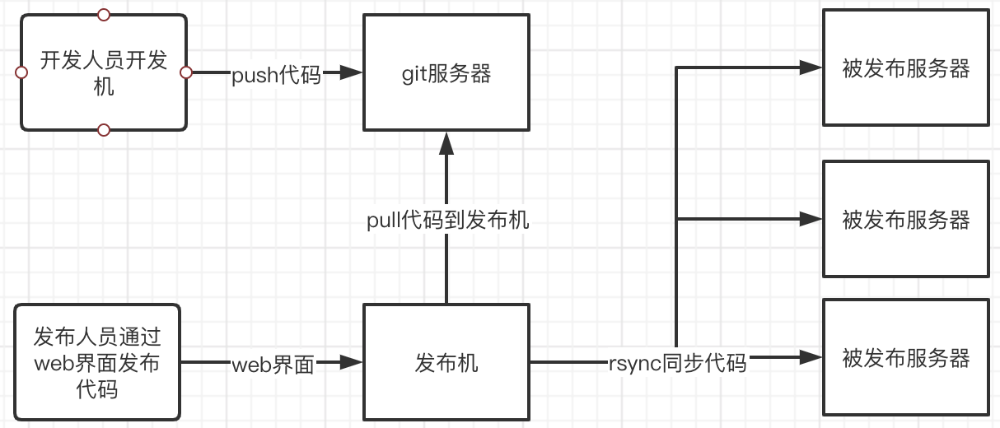  
>
> ```text
> 项目设计大概流程
> 利用git管理代码，发布机去git拉取需要发布的代码到本地
> 经过权限认证然后利用rsync同步代码到需要发布的服务器
> ```


### 开发环境

#### 后端技术栈

> [Golang](https://golang.google.cn/dl/)
>
> [Gin框架](https://gin-gonic.com/#)
>
> [gorm V2.0](https://gorm.io/zh_CN/docs/index.html)
>
> [mysql5.6]()
>
> [ini配置文件解析](https://ini.unknwon.io/docs/intro/getting_started)
>
> [跨域](https://github.com/gin-contrib/cors)
>
> [JWT](https://godoc.org/github.com/dgrijalva/jwt-go#example-NewWithClaims--CustomClaimsType)
>
> [Validator数据验证](https://github.com/go-playground/validator)
>
> [scrypt加密](https://pkg.go.dev/golang.org/x/crypto/scrypt)


#### 前端

> [vue2](https://cn.vuejs.org/)
>
> [elementUI](https://element.eleme.cn/#/zh-CN/component/installation)
>
> [axios](http://www.axios-js.com/)


### 部署

#### 后端部署方法

> ```shell
> ## 1. 建议服务器规格为: 1核CPU，1G内存，100G硬盘
> 
> ## 2. 服务器需要安装nginx、mysql服务
> 安装步骤省略，mysql建议使用5.6版本，nginx可以使用最新版本
> 
> ## 3. 安装sshpass和git包
> # apt install sshpass git -y
> 
> ## 4. 创建文件
> # mkdir -p /root/.ssh
> # vi /root/.ssh/config
> # cat /root/.ssh/config 
> StrictHostKeyChecking no
> UserKnownHostsFile /dev/null
> 
> ## 5. 拷贝项目根目录中的go-deploy-system-server-linux执行程序和config目录到服务器
> # mkdir /data/go-deploy-system-server
> # cd /data/go-deploy-system-server/
> # chmod u+x go-deploy-system-server-linux 
> # ls -l
> drwxr-xr-x 2 root root     4096 Nov 29 16:28 config
> -rwxr-xr-x 1 root root 15679960 Nov 29 16:31 go-deploy-system-server-linux
> 
> ## 也可拉取源码自己进行编译 ##
> # go mod init go-deploy-system-server
> # go mod tidy
> # SET GOOS=linux
> # SET GOARCH=amd64
> # go build -o go-deploy-system-server-linux
> 
> ## 6. 修改配置文件
> # vi config/config.ini
> [server]
> # debug 开发模式; release 生产模式
> AppMode = release
> # 监听地址和端口
> HttpPort = :3000
> # JWT加盐字符串
> JwtKey = 89js82js72@a=KCAFJWQER012
> # 登录密码加盐字符串
> PwdKey = aoefqCINAETCA
> # 服务器、Git密码模式下的key
> ServerGitKey = a&D*71&FBA12-9P*
> # 秘钥文件存储目录
> KeyFilePath = data/go_deployment_system/upload/key
> # 代码存放目录
> CodePath = data/go_deployment_system/git
> [database]
> # 数据库类型需要为MySQL
> # 数据库连接地址
> DbHost = 10.0.1.51
> # 数据库连接端口
> DbPort = 3306
> # 数据库连接账号
> DbUser = root
> # 数据库连接密码
> DbPassWord = 123456
> # 数据库名称
> DbName = go_deployment_system
> [log]
> # 日志文件存储目录
> LogPath = data/go_deployment_system/log
> # 日志文件名称
> LogFileName = ops.log
> # 日志最大保存时间 单位:天
> LogSaveTime = 10
> # 日志切割大小 单位:MB
> LogSplitSize = 10
> 
> 
> ## 7. 创建配置文件中的数据库名称
> # sudo apt update
> # sudo apt install mariadb-server-10.6 相当于mysql5.6
> # sudo mysql_secure_installation
> # mysql -uroot -p123456
> > GRANT ALL PRIVILEGES ON *.* TO 'root'@'%' IDENTIFIED BY '123456' WITH GRANT OPTION;
> > FLUSH PRIVILEGES;
> > create database go_deployment_system character set utf8mb4; 
> 
> ## 将/etc/mysql/mariadb.conf.d/50-server.cnf中bind-address = 127.0.0.1加 #注释掉
> # systemctl start mariadb
> # systemctl enable mariadb
> # systemctl restart mariadb
> 
> ## 8. 启动服务
> # cd /data/go-deploy-system-server/
> # nohup ./go-deploy-system-server-linux &
> # ss -lntp|grep 3000
> LISTEN 0  32768  *:3000  *:*    users:(("go-deploy-syste",pid=28087,fd=8))
> ```


#### 前端部署方法

> ```shell
> ## 1. 拉取前端代码到本地
> # git clone https://gitee.com/lichengguo/go-deploy-system.git
> 
> ## 2. 修改go-deploy-system-web/src/components/common/config.vue文件中的服务器地址
> <script type="text/javascript">
> // 注意更改此处后端的URL路径
> const urlpath = "http://go-deploy-system-server:8888/api/v1";
> 
> export default {
> urlpath,
> };
> </script>
> 
> ## 3. 编译前端代码
> ## 3.1 安装nodejs（包含了npm包管理器）直接下一步安装即可
> ## 下载地址：https://nodejs.org/zh-cn/download/prebuilt-installer
> 
> ## 3.2 全局安装vue脚手架工具
> # npm i -g @vue/cli-init
> # npm i -g @vue/cli
> 
> ## 3.3 安装webpack
> # npm install --save-dev webpack
> 
> ## 3.4 创建一个vue项目
> 如果报错，可能是代理引起的，关闭代理
> #vue init webpack go-deploy-system-web-test
> ? Project name go-deploy-system-web-demo
> ? Project description A Vue.js project
> ? Author Alnk <1029612787@qq.com>
> ? Vue build standalone
> ? Install vue-router? Yes
> ? Use ESLint to lint your code? No
> ? Set up unit tests No
> ? Setup e2e tests with Nightwatch? No
> ? Should we run `npm install` for you after the project has been created? (recommended) (Use arrow keys)
> > Yes, use NPM
> 
> ## 3.5 安装依赖包
> # npm install --save axios@^0.27.2  --save
> # npm install --save element-ui
> 
> ## 3.6 编译，编译后会生成dist目录
> # npm run build
> ```
>
> ```shell
> ## 1. 安装nginx，添加nginx配置文件
> # apt install nginx -y
> # vi /etc/nginx/conf.d/ops-deploy.alnk.com.conf
> server
> {
>     listen       80;
>     server_name  ops-deploy.alnk.com;
>     index index.html;
>     root  /data/go-deploy-system-web/;
>     try_files $uri $uri/ /index.html;
> }
> 
> ## 2. 上传dist目录下的文件index.html和static目录到服务器/data/go-deploy-system-web目录
> # mkdir  -p /data/go-deploy-system-web/
> # ls -l
> -rw-r--r-- 1 root root  524 Nov 29 16:54 index.html
> drwxr-xr-x 5 root root 4096 Nov 29 16:54 static
> 
> ## 3. 重启nginx服务
> # systemctl restart nginx
> ```


### 使用方法

> 访问 nginx中配置的IP或者域名
> 第一次启动发布系统以后，系统会自动生成一个账号 `admin` 密码 `123456` 的管理用户
>
>   
>
> 修改密码
>
> 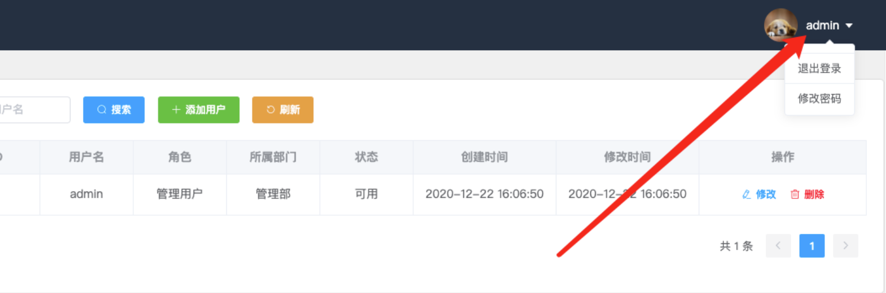    
>
> 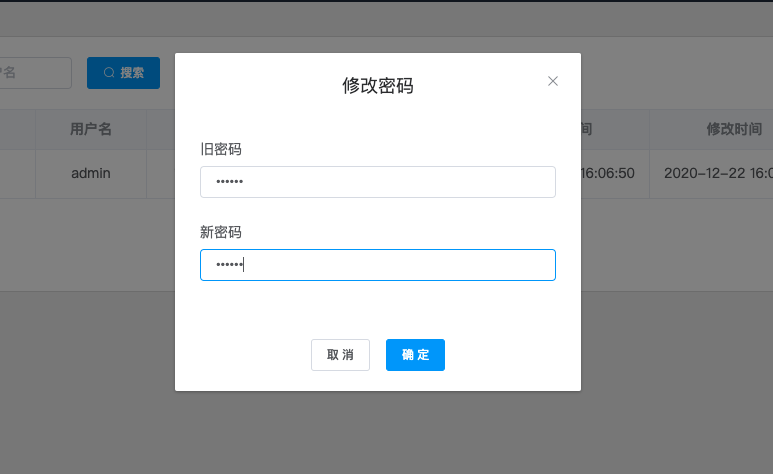  
>
> 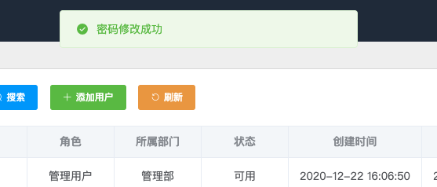 
>


#### 后台管理

> 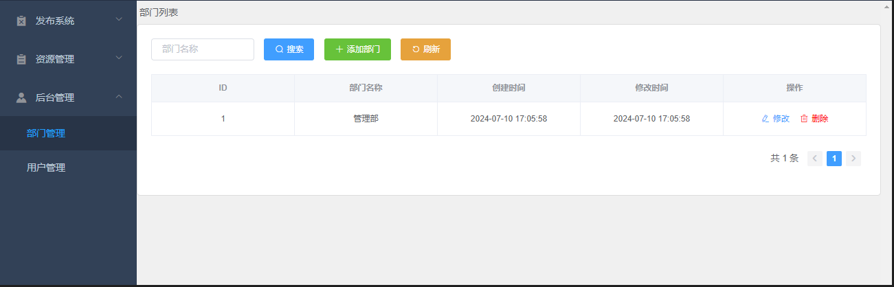   
>
> 
>
> `添加部门`
>
> 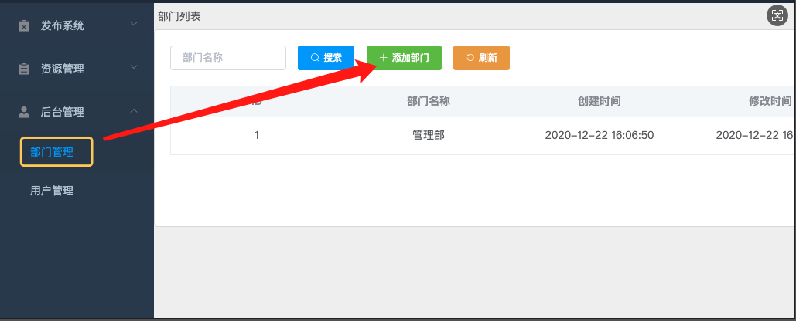  
>
>   
>
> 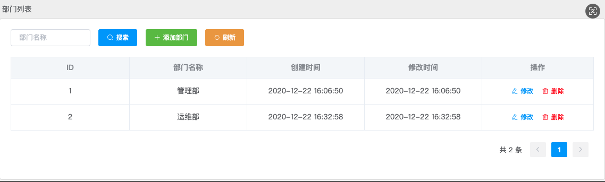  
>
> 
>
> `添加用户`
>
> 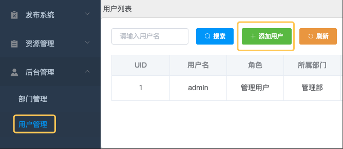  
>
>   
>
> 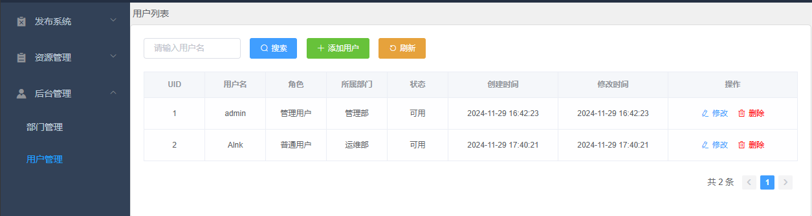  


#### 资源管理

> `创建机房 [同一个机房里面的服务器的名称和IP是唯一的]`
>
> 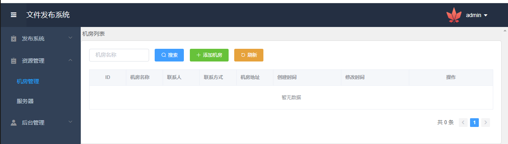  
>
>   
>
>  
>
> 
>
> `添加服务器[服务器可以选择密码或者秘钥的方式进行登录，秘钥方式可以参考后面的示例]`
>
> 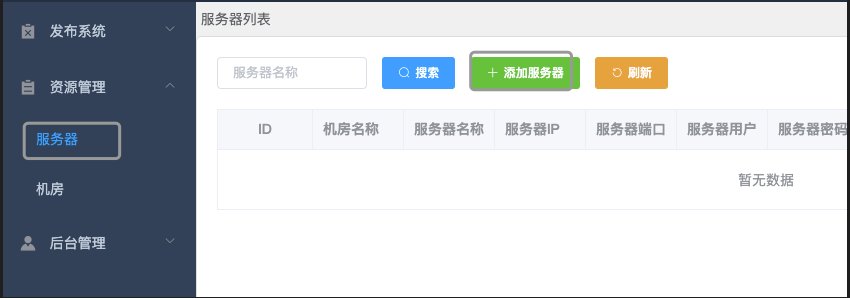  
>
>   
>
> 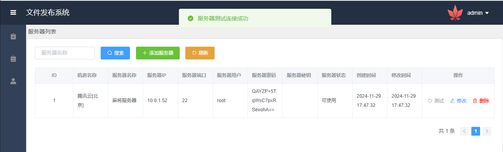  


####  发布系统

> `项目配置`
>
>   
>
> 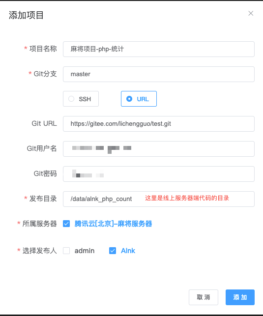  
>
> `允许Alnk账号登录服务器`
>
> 
>
> `发布项目`
>
> 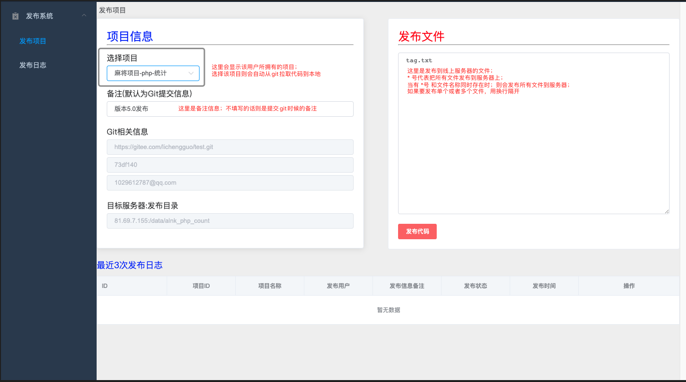  
>
> 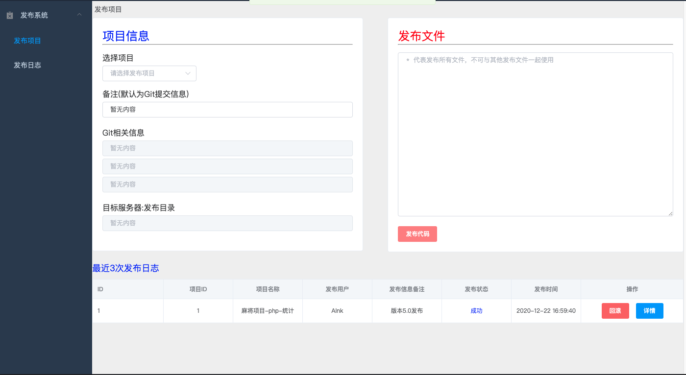  
>
> 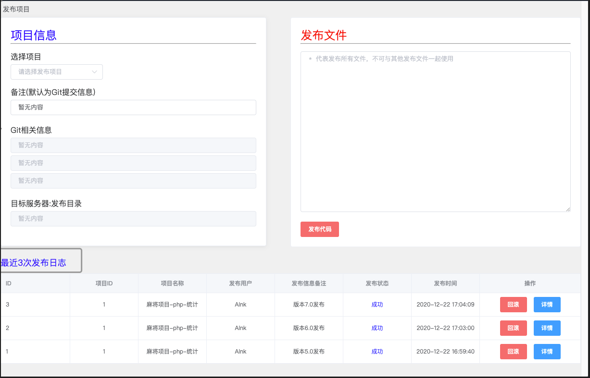  
>
> 
>
> `发布日志与回滚`
>
> 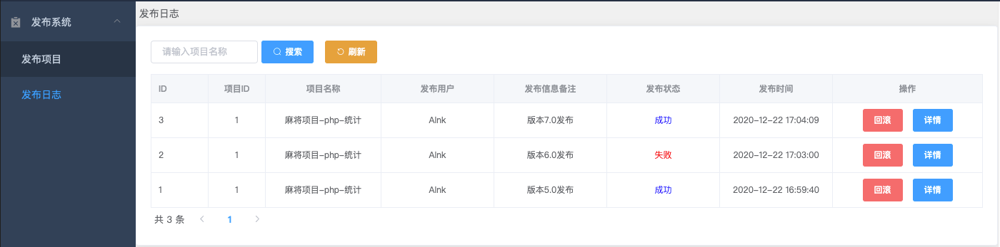  
>
> 
>
> `发布状态为失败的日志不可回滚`
>
> 回滚需要回滚到哪个版本，只需要在发布成功的那条日志中点击回滚即可
>
> 注意如果是第一次发布，则不能回滚
>
> 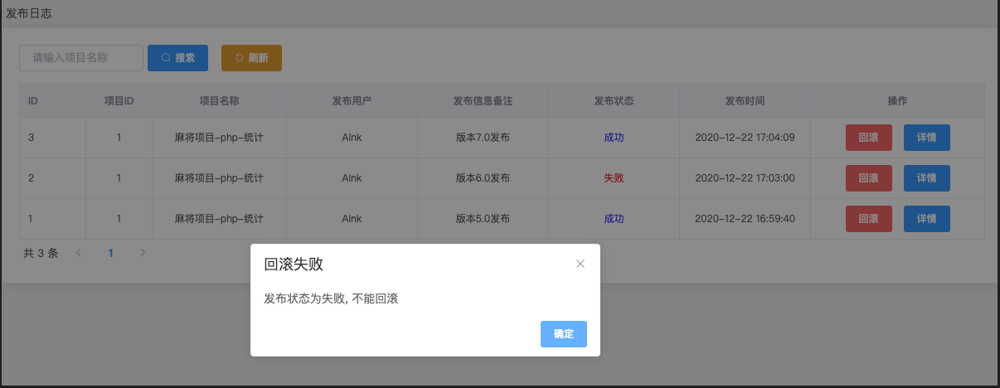  
>
> 
>
> `查看当前线上服务器代码的版本`
>
> 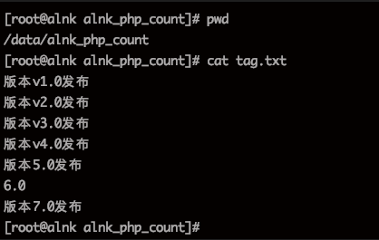  
>
> 
>
> `回滚到5.0版本`
>
> 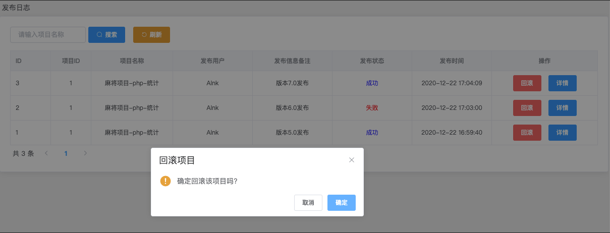  
>
> 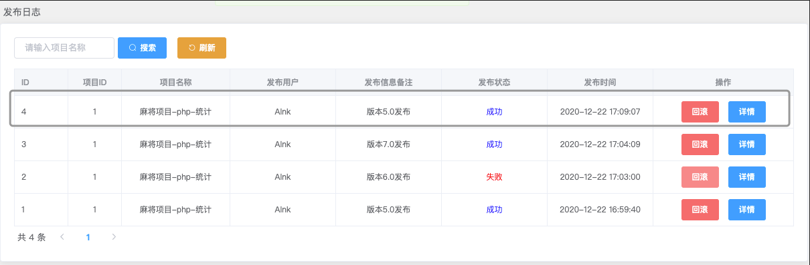  
>
> 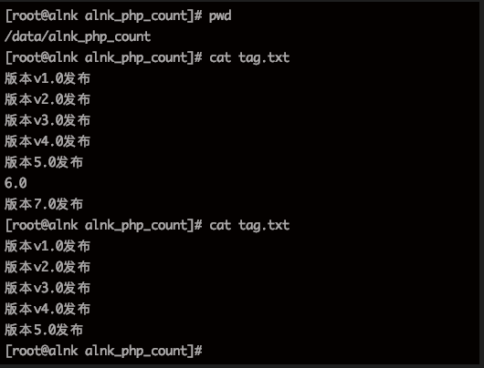  


#### 秘钥

> `使用秘钥的方式拉取git代码和同步代码到服务器上`
>
> `生成一对秘钥,id_rsa为秘钥,id_rsa.pub为公钥`
>
> 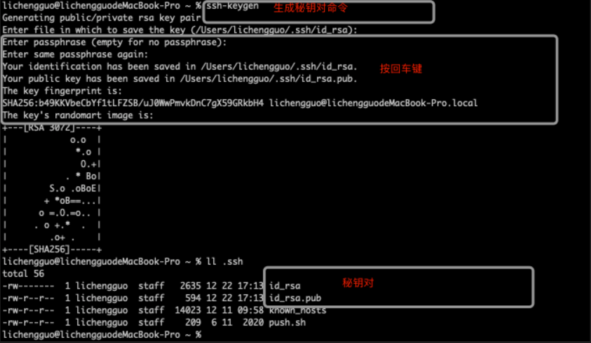  
>
> 
>
> `把公钥添加到git中，这里以gitee为例`
>
>   
>
>   
>
>   
>
>   
>
>   
>
> 
>
> `把公钥添加到线上服务器`
>
> 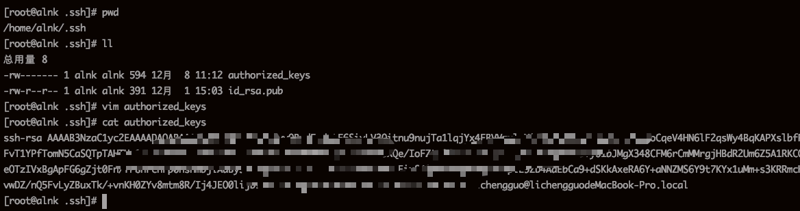  
>
> 
>
> `添加服务器`
>
> 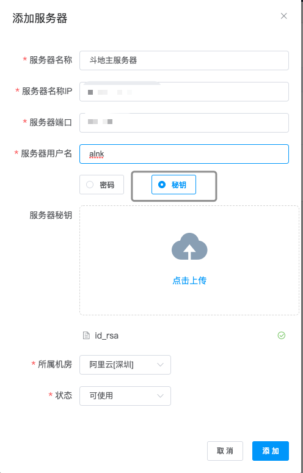 
>
> 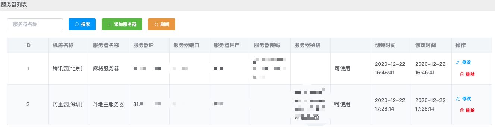  
>
>  
>
> `项目配置`
>
>   
>
>  
>
> `使用Alnk账号登录测试发布`
>
>  
>
>     


