## 文件发布系统使用文档

### 设计思路

拓扑图


利用`git`管理代码，发布机去`git`拉取需要发布的代码到本地，然后利用`rsync`命令同步代码到需要发布的服务器


### 开发环境

##### 后端技术栈

+ [Golang](https://golang.google.cn/dl/)
+ [Gin框架](https://www.kancloud.cn/shuangdeyu/gin_book/949415)
+ [gorm V2.0](https://gorm.io/zh_CN/docs/index.html)
+ [mysql5.6]()
+ [ini配置文件解析](https://ini.unknwon.io/docs/intro/getting_started)
+ [跨域](https://github.com/gin-contrib/cors)
+ [JWT](https://godoc.org/github.com/dgrijalva/jwt-go#example-NewWithClaims--CustomClaimsType)
+ [Validator数据验证](https://github.com/go-playground/validator)
+ [scrypt加密](https://pkg.go.dev/golang.org/x/crypto/scrypt)

##### 前端

+ [vue2](https://cn.vuejs.org/)
+ [elementUI](https://element.eleme.cn/#/zh-CN/component/installation)
+ [axios](http://www.axios-js.com/)


### 后端部署方法

+ 建议服务器规格为: 1核CPU，1G内存，100G硬盘

  

##### 安装步骤

1. 服务器需要安装nginx、和mysql服务

   ```shell
   安装步骤省略，mysql建议使用5.6版本，nginx可以使用最新版本
   ```

   

2. yum install sshpass  git -y  # 安装sshpass和git包

   ```shell
   [root@flask ~]# yum install sshpass  git -y
   [root@flask ~]# rpm -qa |egrep "^git|^sshpass"
   git-1.8.3.1-23.el7_8.x86_64
   sshpass-1.06-2.el7.x86_64
   ```

   

3. 创建文件

   ```shell
   [root@flask ~]# mkdir -p /root/.ssh
   [root@flask ~]# vi /root/.ssh/config
   [root@flask ~]# cat /root/.ssh/config 
   StrictHostKeyChecking no
   UserKnownHostsFile /dev/null
   ```

   

4. 拷贝目录中的 `go-deploy-system-server-linux` 执行程序和` config目录`  到服务器，示例目录为 `/data/go-deploy-system-server/`

   ```shell
   [root@flask ~]# mkdir /data/go-deploy-system-server
   [root@flask ~]# cd /data/go-deploy-system-server/
   [root@flask yf_deploy_system_go]# pwd
   /data/go-deploy-system-server
   [root@flask yf_deploy_system_go]# ll
   总用量 16788
   drwxr-xr-x 2 root root       24 1月  13 16:57 config
   -rw-r--r-- 1 root root 17186870 1月  13 16:53 go-deploy-system-server-linux
   [root@flask yf_deploy_system_go]# chmod u+x go-deploy-system-server-linux 
   [root@flask yf_deploy_system_go]# ll
   总用量 16788
   drwxr-xr-x 2 root root       24 1月  13 16:57 config
   -rwxr--r-- 1 root root 17186870 1月  13 16:53 go-deploy-system-server-linux
   ######################################################
   #也可拉取源码自己进行编译
   go mod init go-deploy-system-server
   go mod tidy
   SET GOOS=linux
   SET GOARCH=amd64
   go build -o go-deploy-system-server-linux
   ```

   

5. 修改配置文件

   vi  config/config.ini

   ```ini
   [server]
   # debug 开发模式; release 生产模式
   AppMode = debug
   # 监听地址和端口
   HttpPort = :3000
   # JWT加盐字符串
   JwtKey = 89js82js72@a=KCAFJWQER012
   # 登录密码加盐字符串
   PwdKey = aoefqCINAETCA
   # 服务器、Git密码模式下的key
   ServerGitKey = a&D*71&FBA12-9P*
   # 秘钥文件存储目录
   KeyFilePath = upload/key
   # 代码存放目录
   CodePath = data/git
   
   [database]
   # 数据库类型需要为MySQL
   # 数据库连接地址
   DbHost = 192.168.3.121
   # 数据库连接端口
   DbPort = 3306
   # 数据库连接账号
   DbUser = root
   # 数据库连接密码
   DbPassWord = root123
   # 数据库名称
   DbName = go_deployment_system
   
   [log]
   # 日志文件存储目录
   LogPath = log
   # 日志文件名称
   LogFileName = ops.log
   # 日志最大保存时间 单位:天
   LogSaveTime = 10
   # 日志切割大小 单位:MB
   LogSplitSize = 10
   ```

   

6. 创建配置文件中的数据库名称

   ```sql
   mysql> create database go_deployment_system character set utf8mb4; 
   Query OK, 1 row affected (0.00 sec)
   ```


7. 后端服务启动

   ```shell
   [root@flask yf_deploy_system_go]# cd /data/go-deploy-system-server/
   [root@flask yf_deploy_system_go]# nohup ./go-deploy-system-server-linux &
   [root@flask yf_deploy_system_go]# netstat -antp|grep 3000
   tcp6       0      0 :::3000                 :::*                    LISTEN      79812/./go-deploy-system-server-linux 
   ```


### 前端部署方法

1. 拉取前端代码到本地
   ```shell
   # git clone https://gitee.com/lichengguo/go-deploy-system-web.git
   ```
2. 修改 go-deploy-system-web/src/components/common/config.vue 文件中的服务器地址
   ```vue
   <script type="text/javascript">
   const urlpath = "http://10.4.7.200:3000/api/v1";
   
   export default {
     urlpath,
   };
   </script>
   ```
3. 编译前端代码
   ```text
   1.安装nodejs（包含了npm包管理器）直接下一步安装即可
   下载地址：https://nodejs.org/zh-cn/download/prebuilt-installer
   
   2.全局安装vue脚手架工具
   #npm i -g @vue/cli-init
   #npm i -g @vue/cli
   
   3.安装webpack
   #npm install --save-dev webpack
   
   4.创建一个vue项目
   如果报错，可能是代理引起的，关闭代理
   #vue init webpack go-deploy-system-web-test
   ? Project name go-deploy-system-web-demo
   ? Project description A Vue.js project
   ? Author Alnk <1029612787@qq.com>
   ? Vue build standalone
   ? Install vue-router? Yes
   ? Use ESLint to lint your code? No
   ? Set up unit tests No
   ? Setup e2e tests with Nightwatch? No
   ? Should we run `npm install` for you after the project has been created? (recommended) (Use arrow keys)
   > Yes, use NPM
   
   5.安装依赖包
   #npm install --save axios@^0.27.2  --save
   #npm install --save element-ui
    
   6.编译，编译后会生成dist目录
   #npm run build
   
   ```

4. 安装nginx，添加nginx配置文件

   ```
   [root@flask ~]# vi /etc/nginx/conf.d/ops-deploy.od.com.conf
   server
   {
          listen       80;
          server_name  ops-deploy.od.com;
          index index.html;
          root  /data/go-deploy-system-web/;
          try_files $uri $uri/ /index.html;
   }
   ```
   

5. 上传前端代码dist目录下的文件index.html和static目录到服务器/data/go-deploy-system-web目录


6. 重启nginx服务
    ```shell
    [root@flask data]# systemctl restart nginx
    ```


### 使用方法
访问 nginx中配置的IP或者域名
第一次启动发布系统以后，系统会自动生成一个账号 `admin` 密码 `123456` 的管理用户，建议登录以后修改密码


修改密码


#### 1. 后台管理


1.1 添加部门


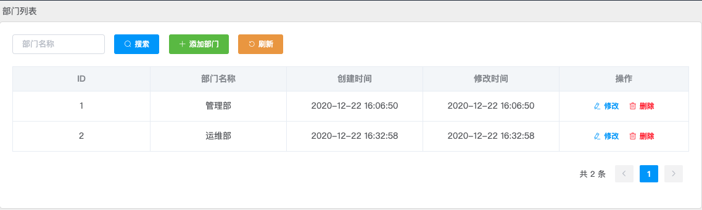


1.2 添加用户


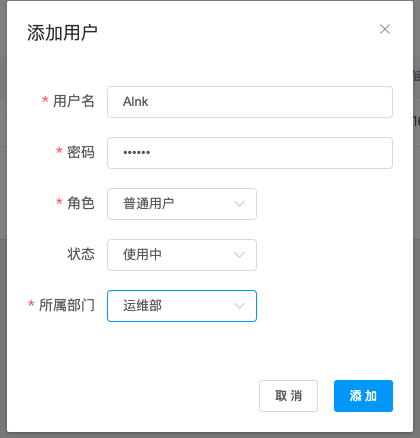


#### 2. 资源管理

2.1 创建机房 [同一个机房里面的服务器的名称和IP是唯一的]


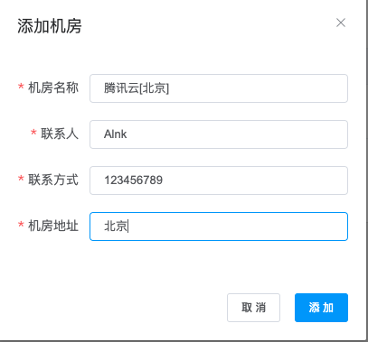


2.2 添加服务器  [服务器可以选择密码或者秘钥的方式进行登录，秘钥方式可以参考后面的示例]

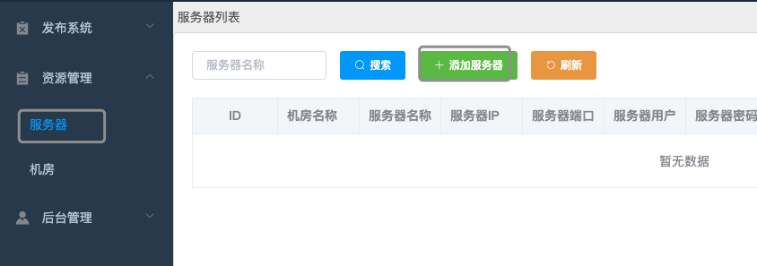


#### 3. 发布系统

3.1 项目配置


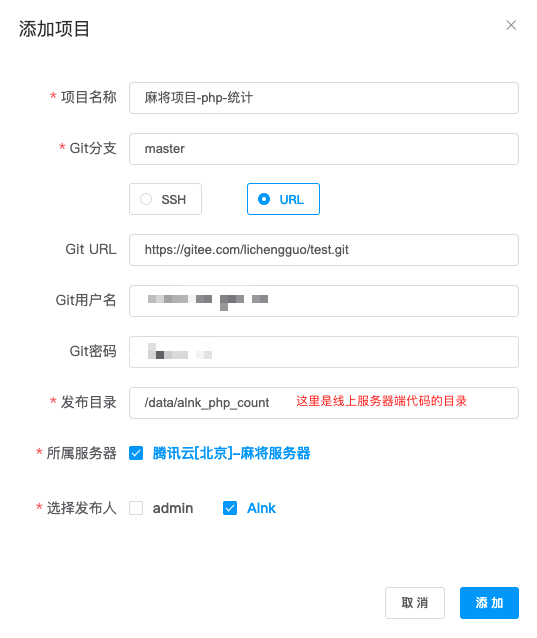

使用`Alnk`账号登录服务器

3.2 发布项目


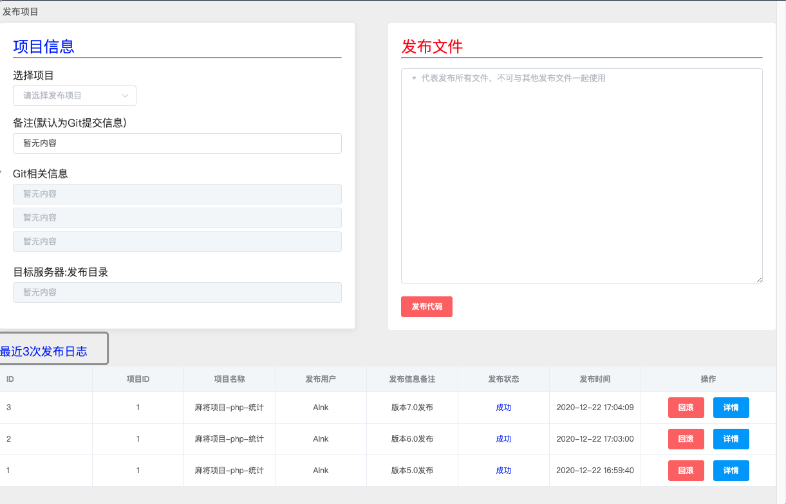


3.3 发布日志与回滚

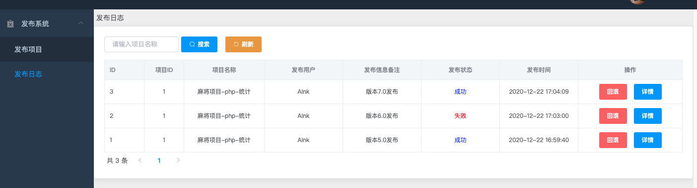


发布状态为 `失败` 的日志不可回滚

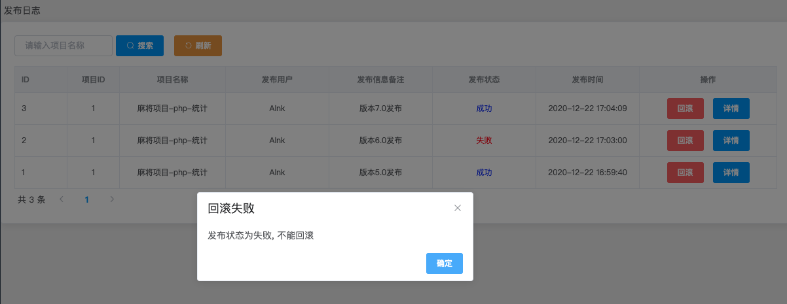


回滚 需要回滚到哪个版本，只需要在发布成功的那条日志中点击回滚即可(注意如果是添加文件则不能回滚)

查看当前线上服务器代码的版本

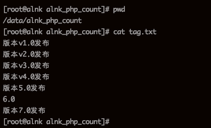

回滚到5.0版本

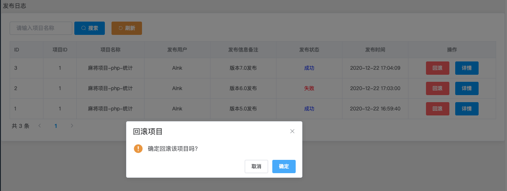

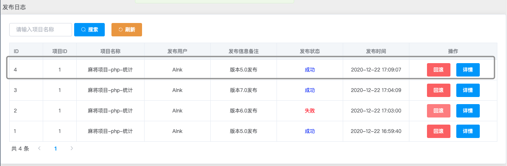

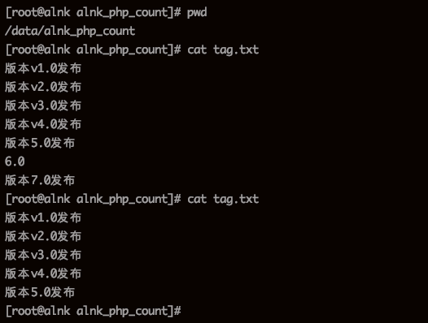


#### 4. 秘钥

使用秘钥的方式 `拉取git代码` 和 `同步代码` 到服务器上

1. 生成一对秘钥 [id_rsa 为秘钥  id_rsa.pub 为公钥]

   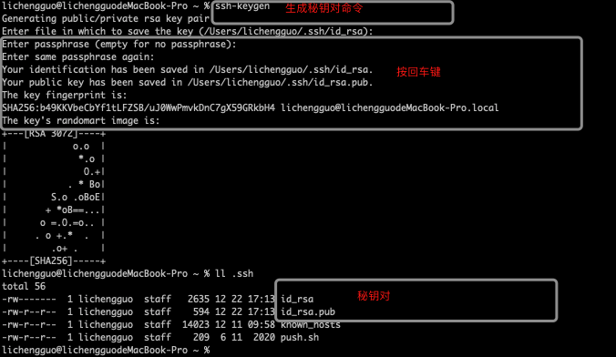

2. 把公钥添加到git中，这里以`gitee`为例

   登录到gitee web界面

    


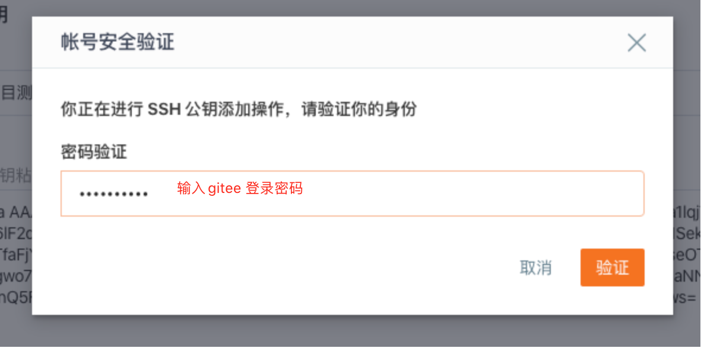


3.把公钥添加到线上服务器


4. 添加服务器


5. 项目配置

   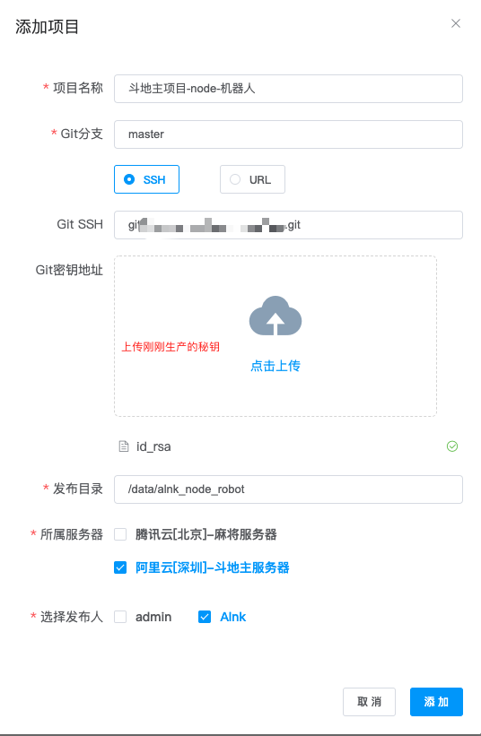

6. 使用`Alnk`账号登录测试发布

   

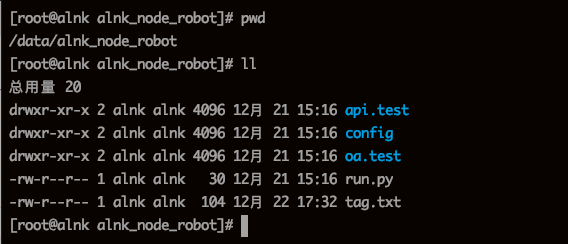

